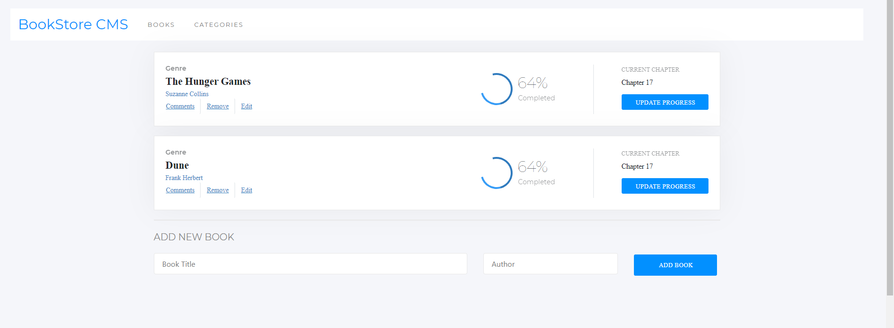

# Bookstore

> This project is a Bookstore app built using React and Redux

## Milestone 1: Initalize project with components
- Created a new React App using CRA.
- Install react-redux.
- Structure application to use ducks pattern.
- Add React-router and set routes and links for app's navigation.
- To get started with CRA, see more information below:

#### Getting Started with Create React App

This project was bootstrapped with [Create React App](https://github.com/facebook/create-react-app).

#### Available Scripts

In the project directory, you can run:

#### `npm start`

Runs the app in the development mode.\
Open [http://localhost:3000](http://localhost:3000) to view it in the browser.

The page will reload if you make edits.\
You will also see any lint errors in the console.

#### `npm test`

Launches the test runner in the interactive watch mode.\
See the section about [running tests](https://facebook.github.io/create-react-app/docs/running-tests) for more information.

#### `npm run build`

Builds the app for production to the `build` folder.\
It correctly bundles React in production mode and optimizes the build for the best performance.

The build is minified and the filenames include the hashes.\
Your app is ready to be deployed!

See the section about [deployment](https://facebook.github.io/create-react-app/docs/deployment) for more information.

### Learn More

You can learn more in the [Create React App documentation](https://facebook.github.io/create-react-app/docs/getting-started).

To learn React, check out the [React documentation](https://reactjs.org/).

## Milestone 2: Create and remove books
- Configure redux store.
- Write actions and reducer for adding and removing books.
- Make elements dispatch actions.
- Use redux-logger to make sure application works correctly.

## Milestone 3: Connect to Api
- Refactor code to use the Bookstore API to add and remove books.

## Milestone 4: 
- Style app using details of Bookstore design in [Zeplin](https://app.zeplin.io/project/5b35a9e13227086040f8eb75/screen/5b695e29bb8c844f118f9378).

## Built With
- React, React Router, Redux, Redux Logger, Webpack, Zeplin, Javascript, React testing library, Babel and Jest

## Author
👤 **Gift Uwhubetine**

- GitHub: [@githubhandle](https://github.com/ghiftee)
- Twitter: [@twitterhandle](https://twitter.com/i_ghiftee)
- LinkedIn: [LinkedIn](https://linkedin.com/in/giftuwhubetine)

## 🤝 Contributing

Contributions, issues, and feature requests are welcome!

Feel free to check the [issues page](../../issues/).

## Show your support

Give a ⭐️ if you like this project!

## 📝 License

This project is [MIT](./MIT.md) licensed.
